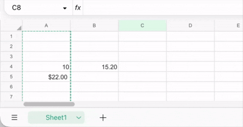

# 📐 ProtonSheetsAggregator.TM

A TamperMonkey userscript that adds an aggregation bar to [Proton Sheets](https://docs-editor.proton.me), showing sum, average, min, max, and count for selected cells.



## 🚀 Install

1. Install [TamperMonkey](https://www.tampermonkey.net/)
2. Click the [latest release](../../releases/latest/download/bundle.user.js) to install

## 🛠️ Development

```bash
npm install
npm run build:dev   # dev build with source maps → dist/bundle.user.js
npm test            # run Jest specs
npm run build       # production build
```

Load `dist/bundle.user.js` directly in TamperMonkey during development.

## ⚙️ CI / Releases

- Every push runs tests and builds the artifact 🧪
- The built `bundle.user.js` is uploaded as a workflow artifact on every commit
- Pushing to `main` updates the `latest` GitHub Release, which is the `@updateURL` / `@downloadURL` TamperMonkey uses for auto-updates 🎉
